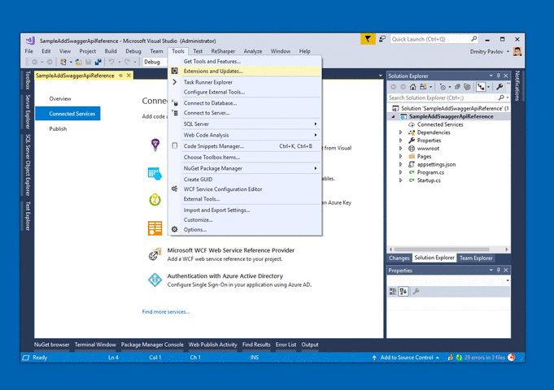

[OpenAPI (Swagger) Connected Service](https://marketplace.visualstudio.com/items?itemName=dmitry-pavlov.OpenAPIConnectedService) is a Visual Studio 2017 extension to generate `C#` `HttpClient` code for `OpenAPI` (formerly [`Swagger API`](https://swagger.io/docs/specification/about/)) web service with [NSwag](https://github.com/RSuter/NSwag)

# Getting Started

Install from `Tools -> Extensions and Updates` menu inside Visual Studio 2017 or [download](https://marketplace.visualstudio.com/items?itemName=dmitry-pavlov.OpenAPIConnectedService)  as `VSIX` package from Visual Studio Marketplace

# HowTos
- [ ] How to open *.nswag files with NSwagStudio from Solution Explorer
- [x] [How to add generated HttpClient to ASP.NET Core dependency injection (DI)](docs/How-to-Add-Generated-HttpClient-to-ASPNETCore-Dependency-Injection.MD)

# Troubleshooting
## Generated code compilation errors
If your project target framework is `net461` you might need to add the following packages via [`NuGet Package Manager`](https://docs.microsoft.com/en-us/nuget/tools/package-manager-ui):
  - [`Newtonsoft.Json`](https://www.nuget.org/packages/Newtonsoft.Json/)
  - [`System.Net.Http`](https://www.nuget.org/packages/System.Net.Http/)
  - [`System.Runtime.Serialization.Json`](https://www.nuget.org/packages/System.Runtime.Serialization.Json/)
## Can't open .nswag file in NSwagStudio
  - If generated code corrupted, try to open `.nswag` file in [`NSwagStudio`](https://github.com/RSuter/NSwag/wiki/NSwagStudio) (Windows GUI for editing .*nswag files). 
- If it doesn't open, try to create new `.nswag` file in [`NSwagStudio`](https://github.com/RSuter/NSwag/wiki/NSwagStudio) for the same API service link and check the differences.
- If you found bug, please report it [here](https://github.com/dmitry-pavlov/openapi-connected-service/issues/new?title=BUG). Thank you in advance!

# Roadmap
See the [changelog](docs/CHANGELOG.MD) for the further development plans and version history.

# Feedback
Please feel free to [request a feature](https://github.com/dmitry-pavlov/openapi-connected-service/issues/new?title=FEATURE) or [report a bug](https://github.com/dmitry-pavlov/openapi-connected-service/issues/new?title=BUG).

