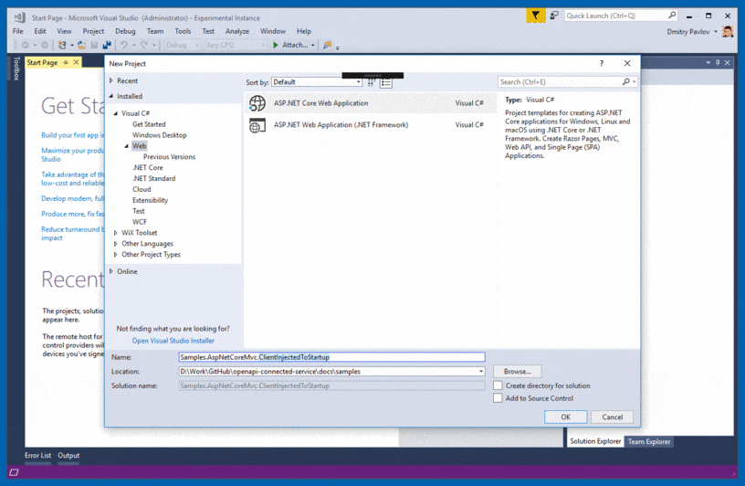
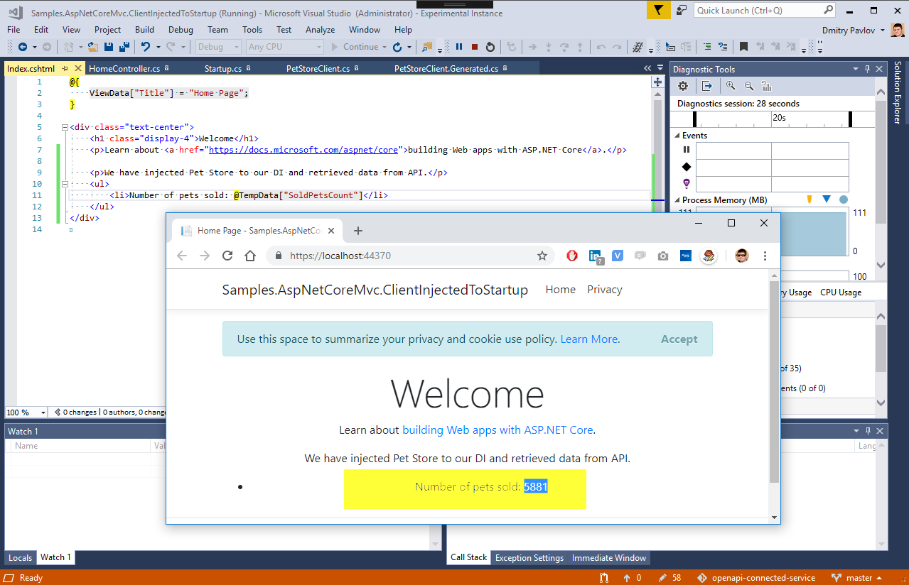

# How to add generated HttpClient to ASP.NET Core dependency injection

[Read this post on Medium as well](https://medium.com/@dmitry.pavlov/how-to-add-generated-httpclient-to-asp-net-core-dependency-injection-right-way-fec21b3385f1)

This `How-To` describes how to inject dependency to `HttpClient` you generated for [PetStore API](http://petstore.swagger.io/) with [OpenAPI (Swagger) Connected Service](https://marketplace.visualstudio.com/items?itemName=dmitry-pavlov.OpenAPIConnectedService) to `ASP.NET Core` application. To achieve this please follow the the steps below:
The sample code is available in [Samples.AspNetCoreMvc.ClientInjectedToStartup](https://github.com/dmitry-pavlov/openapi-connected-service/tree/master/docs/samples/Samples.AspNetCoreMvc.ClientInjectedToStartup).



1. Generate `C#` client class for [PetStore API](http://petstore.swagger.io/) in your `ASP.NET Core` `MVC` web application using [OpenAPI (Swagger) Connected Service](https://marketplace.visualstudio.com/items?itemName=dmitry-pavlov.OpenAPIConnectedService). See [Getting Started](https://github.com/dmitry-pavlov/openapi-connected-service/) section to install and run this `Visual Studio` extension.
2. Add new file `PetStoreClient.cs` and make sure the class is marked as `partial` and has the same name and namespace as generated `public partial class Client` in `PetStoreClient.Generated.cs`. Also define the interface `IPetStoreClient`. The idea behind using the interface `IPetStoreClient` is to separate the methods you see where your client is used from what you don't want to expose. In this sample we just expose the method to retrieve the number of pets sold by the store. So we define the method `GetSoldPetsCount`, which internally uses generated method for [GET pet/findPetsByStatus](http://petstore.swagger.io/#/pet/findPetsByStatus) endpoint. That is how it might look like: 
```csharp
using System.Collections.Generic;
using System.Threading.Tasks;

namespace Samples.AspNetCoreMvc.ClientInjectedToStartup.PetStore
{
    /// <summary>This partial class allows to wrap and extend the generated client logic if you need that.</summary>
    public partial class Client : IPetStoreClient
    {
        // Note: let's implement the interface methods we want to expose

        public async Task<int> GetSoldPetsCountAsync()
        {
            ICollection<Pet> soldPets = await this.FindPetsByStatusAsync(new[] { Anonymous.Sold });
            return soldPets.Count;
        }
    }

    /// <summary>Interface defines what we want to expose in our appliction via dependency injection.</summary>
    public interface IPetStoreClient
    {
        /// <summary>Returns number of all sold pets in the store.</summary>
        Task<int> GetSoldPetsCountAsync();

        // NOTE: you can also define here methods from generated Client partial class to expose them from interface.
    }
}
```
3. Now let's use [`HttpClientFactory`](https://docs.microsoft.com/en-us/dotnet/standard/microservices-architecture/implement-resilient-applications/use-httpclientfactory-to-implement-resilient-http-requests) to inject the `IPetStoreClient`. Go to `Startup.cs` and add this to `ConfigureServices(IServiceCollection services)`:
```csharp
public void ConfigureServices(IServiceCollection services)
{
    ...

    // Inject generated PetStore client via using HttpClientFactory to implement resilient HTTP requests.
    services.AddHttpClient<IPetStoreClient, Client>((provider, client) =>
    {
        client.BaseAddress = new System.Uri("https://petstore.swagger.io/v2/");
    });
    services.AddMvc().SetCompatibilityVersion(CompatibilityVersion.Version_2_2);
}
```
4. In `Index` action in `HomeControler.cs` let's inject `IPetStoreClient` and pass the number of sold pets to the `View`:
```csharp
public class HomeController : Controller
{
    private readonly IPetStoreClient _petStoreClient;

    public HomeController(IPetStoreClient petStoreClient)
    {
        _petStoreClient = petStoreClient;
    }

    public async Task<IActionResult> Index()
    {
        TempData["SoldPetsCount"] = await _petStoreClient.GetSoldPetsCountAsync();
        return View();
    }
    ...
}

```
5. To display the number of sold pets on the default site page add this code to `Views\Home\Index.cshtml`:
```aspnet
@{
    ViewData["Title"] = "Home Page";
}

<div class="text-center">
    <h1 class="display-4">Welcome</h1>
    <p>Learn about <a href="https://docs.microsoft.com/aspnet/core">building Web apps with ASP.NET Core</a>.</p>

    <p>We have injected Pet Store to our DI and retrieved data from API.</p>
    <ul>
        <li>Number of pets sold: @TempData["SoldPetsCount"]</li>
    </ul>
</div>

```
That's it! We have injected generated client for [PetStore API](http://petstore.swagger.io/) to `ASP.NET Core` application via the [dependency injection (DI)](https://docs.microsoft.com/en-us/aspnet/core/fundamentals/dependency-injection) software design pattern.



Find more [**Getting Started**](https://github.com/dmitry-pavlov/openapi-connected-service/) articles in the documentation and feel free to [request](https://github.com/dmitry-pavlov/openapi-connected-service/issues/new?title=DOC:+HowTo+&body=Please%20write+how+to+...) new one.
